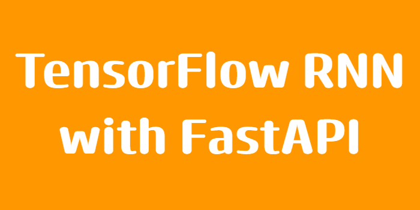

# Api_rnn



## About
This is a project for phishing detection using machine learning in python. 
Where we used tensorflow to train a model then deploy it as a api service with fastapi.
For the training we used recurrent units witch you can find more about [here](https://en.wikipedia.org/wiki/Gated_recurrent_unit).

## Documentation
1. FastApi
    - [Documentation](https://fastapi.tiangolo.com)
    - [Source_Code](https://github.com/fastapi/fastapi)
2. Tensorflow
    - [Documentation](https://www.tensorflow.org/)
    - [Source_Code](https://github.com/tensorflow)
## Installation and setup
### Installation
Use the package maneger [pip](https://pip.pypa.io/en/stable/installation/) to install FastAPI and Tensorflow
```bash
pip install "fastapi[standard]"
pip install tensorflow
```
### Setup
Run a [uvicorn](https://www.uvicorn.org/) server
```bash
fastapi dev api_rnn/api_rnn.py
```
You will get a link like this [http://127.0.0.1:8000](http://127.0.0.1:8000)
and this [http://127.0.0.1:8000/docs](http://127.0.0.1:8000/docs).\
Where [http://127.0.0.1:8000/docs](http://127.0.0.1:8000/docs) is ran with 
[Swagger](https://swagger.io/) which is a open-source GUI for API development
or you can use [Postman](https://web.postman.co/) or [curl](https://curl.se/).

## Aditional Info
This is the general idea but their is still alot that can be added in this project.
